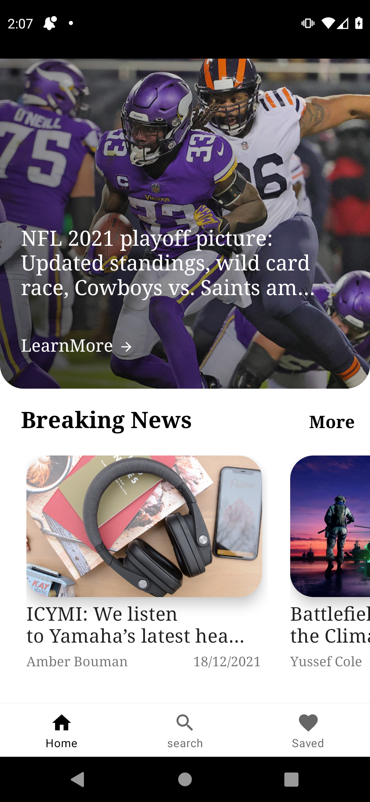

# News

This app shows you the latest news within the last two hours.
also it let's you search for custom news. show news detalis or
visit news webiste for more detalis, also it shows the latest headlines. 
and allows you to save the news for later use. it uses
<ul>
  <li>MVI (architecture pattern),
  <li>Single Activity Model,
  <li>hilt (for dependecy injection),
  <li>retrofit (for fetching data from web service),
  <li>room(for caching data),
  <li>glide (for imageLoading),
  <li>mapper classes
</ul>

<h2>Home Screen</h2>

<h2>Search Screen</h2>

<h2>Profile Expanded Screen</h2>

<h2>Profile Collapsed Screen</h2>

